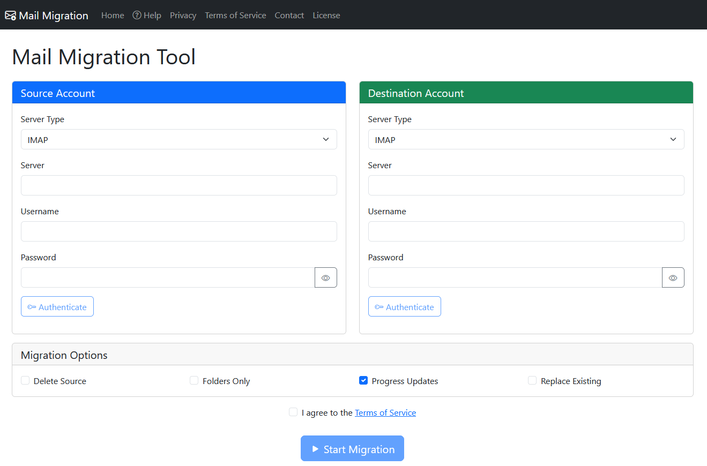
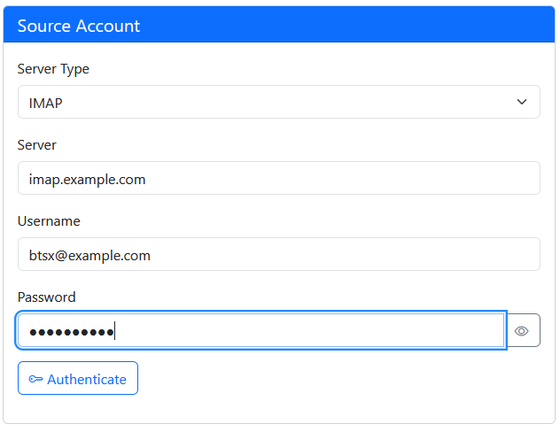
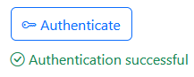
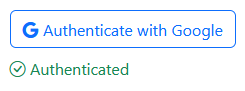
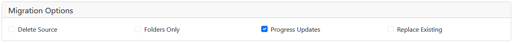

# Starting Migration Job with the Web Interface

This guide walks you through configuring and starting a email migration job using the BTSX web interface.

## Prerequisites

- BTSX web application running (see [Installation](../installation/local/) or use a [hosted instance](https://btsx.nz)).
- Source Email Account details.
- Destination Email Account details.
- Both email servers must be accessible from the public internet.
- 
## Configuring a Migration Job

### Source &amp; Destination Account Configuration

Fill in the source &amp; destination account details.
First, select the ***Server Type*** which will dictate how authentication is performed.

#### IMAP Servers
IMAP is the most common type for commodity and in-house mail hosts.
With an IMAP server, you need to enter the details as below:

1. **Server**: IMAP server hostname (e.g., `imap.example.com`).
2. **Username**: Your email address or IMAP username.
3. **Password**: Your account password.
  - Use the "peak" toggle to view the password in clear text.

If you are using a mail client such as Outlook or Thunderbird, these will be the same details you used to configure that application. 

Once you have entered this information, click the **Authenticate** button.
The system will attempt to authenticate with the provided details the check that they are correct.
You will not be able to start the migration until this step has completed. 

#### OAuth Enabled Servers
Providers such as GMail use an OAuth based authentication protocol.
For these type of accounts, select the provider from the **Server Type** drop down 

Then use the **Authenticate with** button to invoke the AOuth authentication process.
You will be redirected to the providers login page to login using your account details for the provider.
After a successful login, you will be redirected back to the Mail Migration Tool and the **Authenticated** tick will be displayed. 

#### Unsupported Server Types
The Mail Migration tool does not yet support OAuth authentication for all mail providers that have implemented it.
In these cases, you can usually use the IMAP option.
It normally involves generating an App Password for your account and using that with the IMAP server details for your provider.
See the help documentation for you email provider to see how they support the IMAP protocol.

## Migration Options
There are several options that con be configured to customise how the migration will occur as described below.

- Delete Source
  - When selected, email messages will be deleted from the Source Account after they have been copied to the Destination Account.
  - If you are only taking a back up, leave this option un-checked.
- Folders Only
  - When selected, only the folder structure of the Source Account will be copied to the Destination Account.
  - This can be used as a dry-run to confirm the migration will work the way you expect.
- Progress updates
  - When selected, the system will provided a progress bar and percent complete updates as the migration occurs.
  - This option requires the system to count all email messages in the Source Account before copying any messages, which will increase the time taken to run the migration job.
- Replace Existing
  - When checked, the system will check to see if a message from the Source Account exists in the same folder in the Destination Account before copying the message.
  - This will increase the time taken for the migration and is not  necessary when the Destination Account is new and empty.
  - The check is done by looking for a message with the same Message ID header in the destination folder.
  - When unchecked, all messages from the Source Account will be copied to the Destination Account, which could result in duplicate messages if a migration has previously been performed.
  - If a Migration Job is restarted, the Replace Existing option will be enabled to ensure duplicates are not created.

## Starting the Migration

Before starting the migration, you must agree to the Terms Of Service.

If both the source and destination accounts are authenticated and the Terms of Service are agreed, the **Start Migration** button will be enabled.
Click the **Start Migration** button.
The system will start the migration job running and direct you to the [Status](../20-status/) page, where you can monitor the job. 

