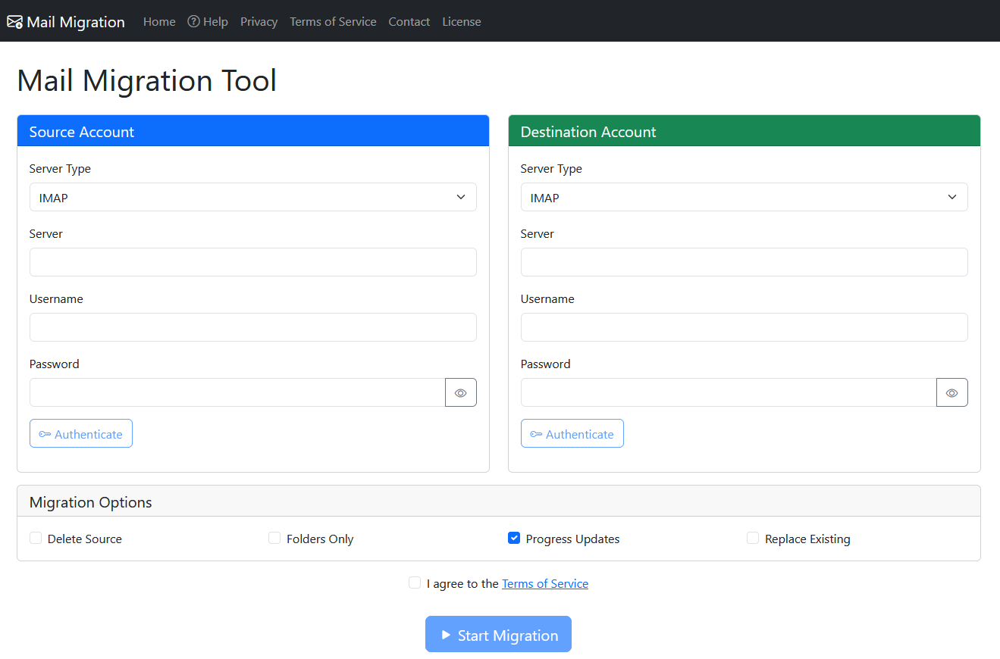
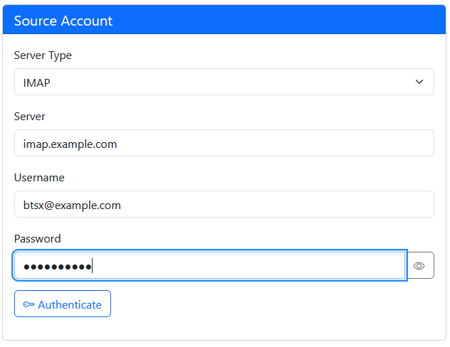
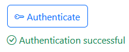
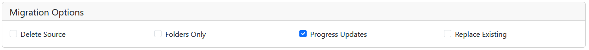
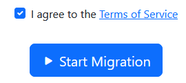

# Starting Migration Job with the Web Interface

This guide walks you through configuring and starting a email migration job using the BTSX web interface.

## Prerequisites

- BTSX web application running (see [Installation](../installation/local/) or use a [hosted instance](https://btsx.nz)).
- Source Email Account details.
- Destination Email Account details.
- Both email servers must be accessible from the public internet.
- 
## Configuring a Migration Job

### Migration Type

At the top of the page, select the **Migration Type** from the dropdown menu:

- **Full Migration**: Migrates both folder structure and email messages (default).
- **Folders Only**: Migrates only the folder structure without copying messages.

### Source &amp; Destination Account Configuration

Fill in the source &amp; destination account details.
First, select the ***Server Type*** which will dictate how authentication is performed.

#### IMAP Servers
IMAP is the most common type for commodity and in-house mail hosts.
With an IMAP server, you need to enter the details as below:

1. **Server**: IMAP server hostname (e.g., `imap.example.com`).
2. **Username**: Your email address or IMAP username.
3. **Password**: Your account password.
  - Use the "peak" toggle to view the password in clear text.

If you are using a mail client such as Outlook or Thunderbird, these will be the same details you used to configure that application. 

Once you have entered this information, click the **Authenticate** button.
The system will attempt to authenticate with the provided details the check that they are correct.
You will not be able to start the migration until this step has completed. 

#### OAuth Enabled Servers
Providers such as GMail use an OAuth based authentication protocol.
For these type of accounts, select the provider from the **Server Type** drop down 

Then use the **Authenticate with** button to invoke the AOuth authentication process.
You will be redirected to the providers login page to login using your account details for the provider.
After a successful login, you will be redirected back to the Mail Migration Tool and the **Authenticated** tick will be displayed. 

#### Unsupported Server Types
The Mail Migration tool does not yet support OAuth authentication for all mail providers that have implemented it.
In these cases, you can usually use the IMAP option.
It normally involves generating an App Password for your account and using that with the IMAP server details for your provider.
See the help documentation for you email provider to see how they support the IMAP protocol.

## Migration Options
There are several options that con be configured to customise how the migration will occur as described below.

- **Delete Source**
  - When selected, email messages will be deleted from the Source Account after they have been copied to the Destination Account.
  - If you are only taking a back up, leave this option un-checked.
- **Progress updates**
  - When selected, the system will provided a progress bar and percent complete updates as the migration occurs.
  - This option requires the system to count all email messages in the Source Account before copying any messages, which will increase the time taken to run the migration job.
- **Duplicate Handling**
  - Controls how the system handles messages that already exist in the destination folder.
  - The check is done by looking for a message with the same Message ID header in the destination folder.
  - Available options:
    - **Overwrite**: Replaces existing messages in the destination with the version from the source. Use this when you want to ensure the destination has the latest version of each message.
    - **Skip**: Skips copying messages that already exist in the destination. This is the fastest option and useful for resuming interrupted migrations or syncing new messages.
    - **Create Duplicate**: Copies all messages regardless of whether they exist in the destination. This will create duplicate messages if a migration has previously been performed. Use this only when the destination is empty or you intentionally want duplicates.
  - If a Migration Job is restarted, the Duplicate Handling will default to **Skip** to avoid unnecessary work and ensure duplicates are not created.

## Starting the Migration

Before starting the migration, you must agree to the Terms Of Service.

If both the source and destination accounts are authenticated and the Terms of Service are agreed, the **Start Migration** button will be enabled.
Click the **Start Migration** button.
The system will start the migration job running and direct you to the [Status](../20-status/) page, where you can monitor the job. 

