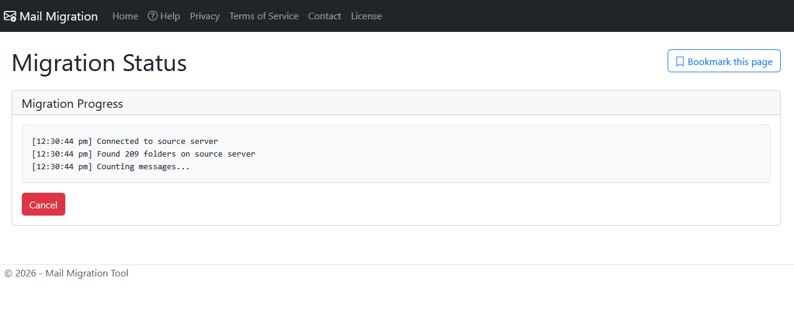
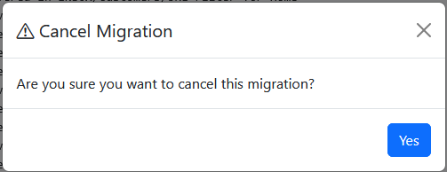
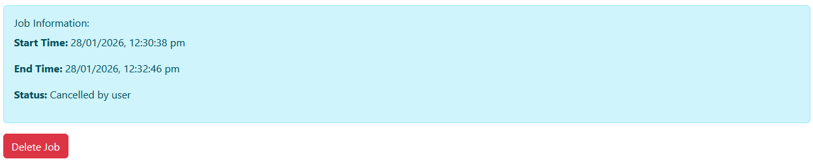
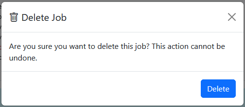
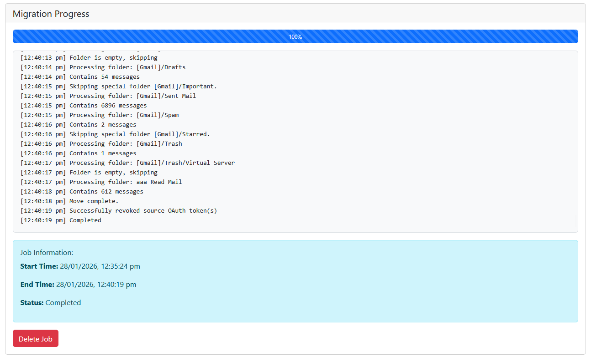

# Status Monitoring
The status page provides real-time feedback on your email migration progress
and completion status. A Migration Job is identified by a unique ID, which
is visible in the address bar as the last part of the URL after the final "/" character.

## Migration status
The server will send status updates to the status page.
These are displayed as they arrive.

## Progress Bar
If the **Progress Updates** option was selected on the [start page](../10-start#migration-options), a progress bar will be displayed.
Progress will be calculated as the percentage of mail messages processed, so there may be a delay at the start of the migration job
as the total number of mail messages are counted. This is because each folder in the source server must be opened to attain
a count of messages.

# Job Management
As well as monitoring, the status page gives you the option to cancel running jobs and delete completed jobs.

## Cancelling a Migration Job
To cancel a running job, click the **Cancel** button. The system will prompt you to confirm. 

On confirmation, the job will be terminated. The job will still be available to view in the system until it is deleted. 

## Deleting a Migration Job
Migration Jobs are automatically deleted 7 days after they complete (whether successfully or in error).
This delay gives you time to check the completion status a job that may be long running.

Any completed job can be deleted without waiting by clicking the **Delete** button. 

The system will prompt you to confirm. On confirmation, the job data is deleted from the server
and you will be redirected back to the [start page](../10-start).

## Bookmarking a Migration Job
If a job looks like it will take some hours (or days) to complete, you may want to bookmark the
status page so you can come back later to check on progress. The **Bookmark** button
is there to help you do this.

OK, it's a hack, it just tells you press Ctrl+D. But there's no way to programmatically make a modern browser save a bookmark,
so this will have to suffice.

# Job Completion
When a Migration Job completes, the status page will update to show you completion status of the job. 

You can delete the job now, or leave it for automatic deletion after 7 days.

# Job Persistence
The Mail Migration Tool is designed as a privacy preserving application.
Only the minimum amount of data required to do the job is requested from you.
You are not required to create an account or jump through any other nonsense hoops that are only there to capture your data.

The system will store this data on disk in order to enable a Migration Job to be re-started if the server process has to be
restarted while your job is running. Any usernames, passwords and access tokens will be encrypted on disk while the job is running.

Once the Migration Job is complete, usernames, passwords and access tokens are deleted. The source and destination servers
and job completion status is retained for 7 days from the completion of the job.
